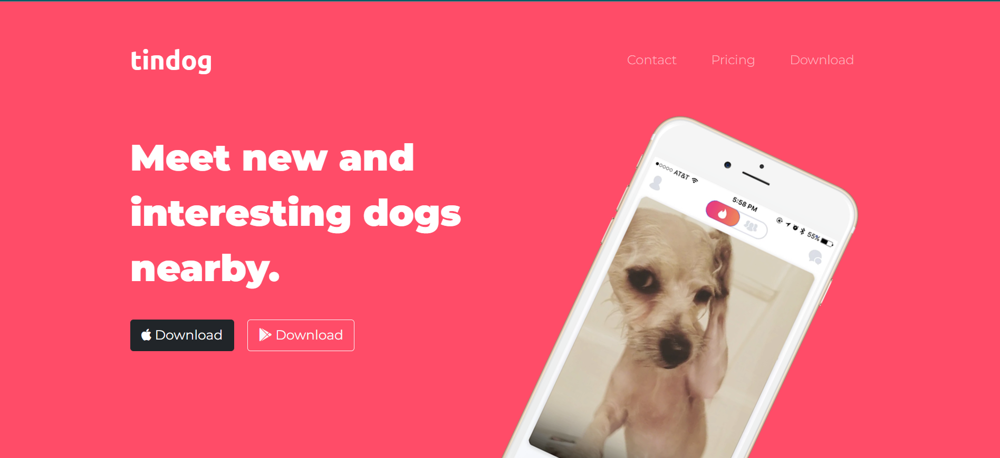
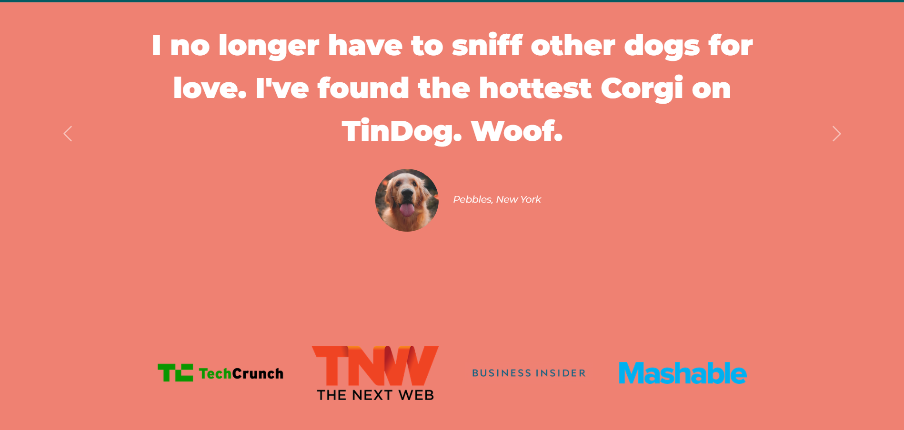
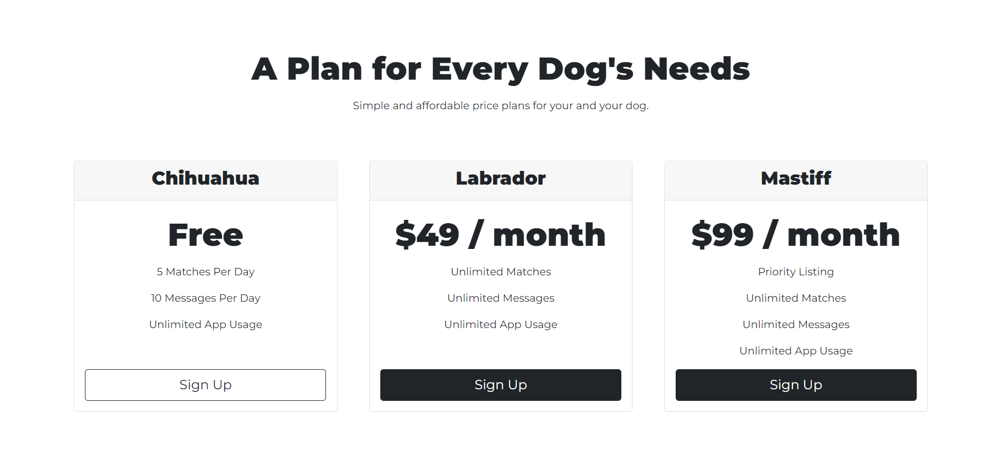
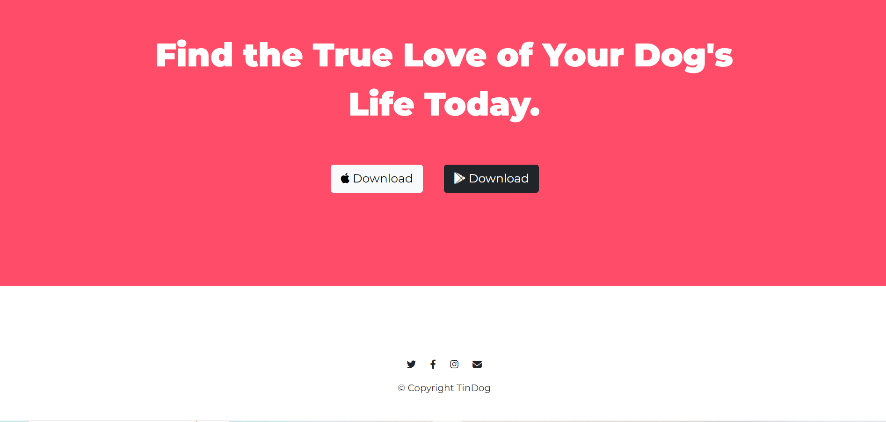

# The Complete 2022 Web Development Bootcamp - Tindog Webpage Design

This is a solution to the [QR code component challenge on Frontend Mentor](https://www.frontendmentor.io/challenges/qr-code-component-iux_sIO_H). Frontend Mentor challenges help you improve your coding skills by building realistic projects.

This is a completed webpage design project for [The Complete 2022 Web Development Bootcamp at Udemy](https://www.udemy.com/course/the-complete-web-development-bootcamp/) at Udemy.


## Overview

### Screenshot







### Links

- Live Site URL: [Add live site URL here](https://your-live-site-url.com)


## My process

### Built with

- Semantic HTML5 markup
- Bootstrap 5
- CSS custom properties
- CSS Grid
- [Fontawesome](https://fontawesome.com/) - For styles


### What I learned

Throughout this project, I have learn how to use Bootstrap 5 ranging from applying Grid layout, Buttons, Container, Carousel, and Cards in my webpage. I have also learn how to use media query, CSS Z-Index and stacking order, and combine selector.

A major learning progress is to learn how to refactor my code to make it better in terms of readability and reducing repetitive code. However, there is still much to learn from this and I hope to develop more understanding about refactoring code.

I am especially fond of this mechanic where you are bring to the page when you click on the anchor tag
```html
<ul class="navbar-nav ms-auto">
  <li class="nav-item active">
    <a class="nav-link" href="#footer">Contact</a>
  </li>
  <li class="nav-item">
    <a class="nav-link" href="#pricing">Pricing</a>
  </li>
  <li class="nav-item">
    <a class="nav-link" href="#cta">Download</a>
  </li>
</ul>
```

Some css code that uses combine selector to style accordingly and a code snipper of a media query
```css
#title .container-fluid {
    padding: 3% 13% 9%;
}

@media (max-width: 991.2px) {
    #title {
        text-align: center;
    }

    .title-image {
        position: static;
        transform: rotate(0);
        align-items: center;
    }
}
```


### Useful resources

- [Bootstrap 5](https://getbootstrap.com/docs/5.0/getting-started/introduction/) - Bootstrap 5 is a powerful framework for developing a responsive website that works well for all view from desktop to mobile.
- [Fontawesome](https://fontawesome.com/) - This is an amazing website to get the icon you need. It is easy to use and there are a lot of available choices to choose from the website. I would reccomend this to anyone building a webpage using this.


## Author

- Github - [Cheng Wuai](https://github.com/S-CW)
- LinkedIn - [@sing-cheng-wuai-5198a91b5](https://www.linkedin.com/in/sing-cheng-wuai-5198a91b5/">LinkedIn)


## Acknowledgments

First and foremost, I would like to thank Dr. Angela Yu who guided us in doing this projects. She has provided invaluable advice and teaching to help us understand more into Web Development. Also to the student following the course with some useful tips on how to tackle some obstacle faced in building this project
